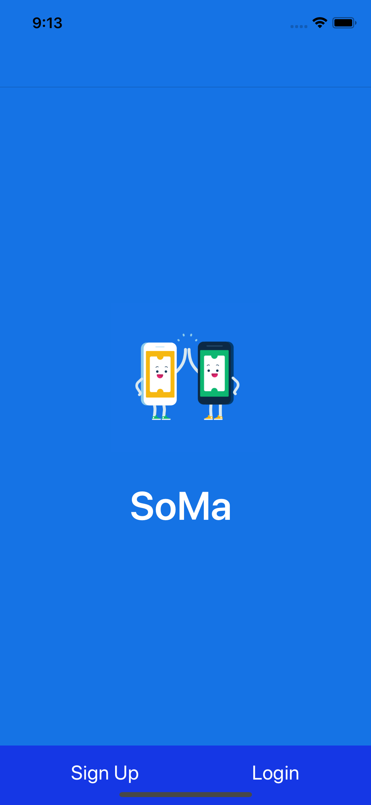
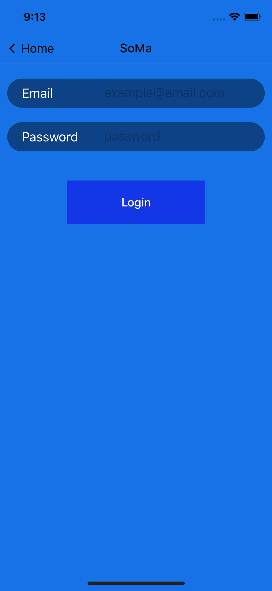

# SoMa
<h3 align="center">
  SoMa
</h3>

  Sell your stuff safely!

### [Demo - Try it on Expo](https://expo.io/@anlai2/SoMaApp)

## Features

- Users can post sell/buy posts to sell their junk with profile ratings, transaction location, and SafeTrek API integration.

- With SafeTrek, users will have a peace of mind while making transactions with strangers, having emergency responses with a 
push of a button.

- SoMa also allows users to purchase items online safely with certified SafeTrek user profiles.

### Screenshots

  
  

More screenshots to come!

## TODO

Many issues that will occur will be opened on this github page, below are milestones/enhancements

- [ ] RNRF to React-Navigation
  - Use createBottomTabNavigator to route through news, portfolio, and dashboard screens.

- [x] API’s used
  * [CoinMarketCap.com API](https://coinmarketcap.com/api/documentation/v1/) for latest coin prices
  * [Twilio API](https://www.twilio.com/docs/api) for OTP authentication 
  * [Crypto Coins News API](https://newsapi.org/s/crypto-coins-news-api) for latest cryptocurrency news

- [ ] Start building prototype
  - [ ] Fix android UI design bugs
  - [ ] Get feedback
  - [ ] Prepare deployment to stores (Due by 08/27/18)

- [ ] Create a React Web App with a similiar backend 
  - [ ] Move from firebase to MongoDB
  - [ ] Create REST API for backend use (GET/POST/DELETE portfolio)
  
- [ ] Add visualization data such as graphs and pie charts using historical data.
  - [ ] Move CMC.com API to a more advanced API that has live and historical prices.
  - [ ] Requires a backend and database

## Feedback

Open an issue, make a PR, or send me an email at anlaics2@gmail.com
